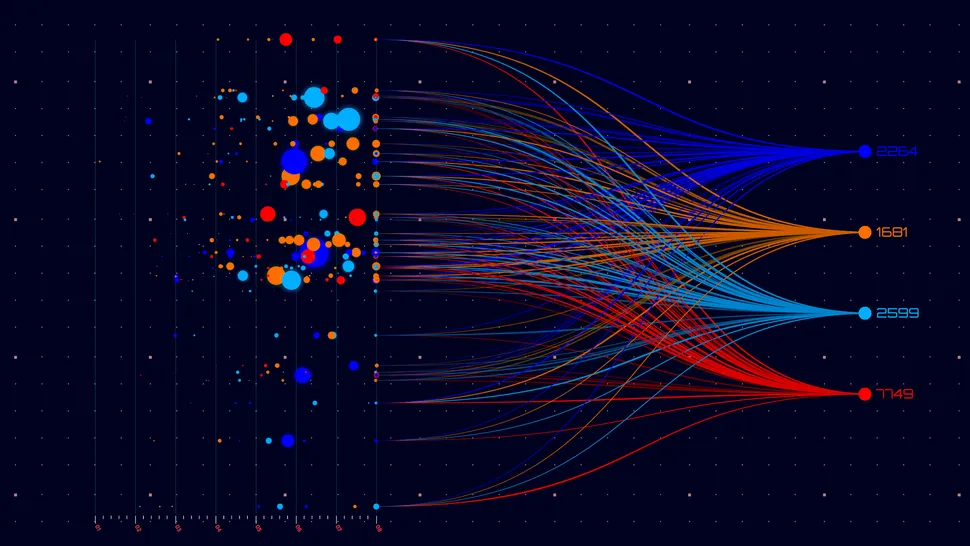

# Análise de Dados

**Nome do Estagiário:** Guilherme Canarini Kaneda
**Data:** 01/08/2024

**Módulos:**  
1. **Definição**
2. **Ciclo da Análise de Dados**
3. **Ferramentas** 
4. **Laboratórios** 

## Definição
A análise de dados é o processo de inspecionar, sintetizar e modelar dados a fim de adquirir informações para uma aplicação, auxiliando a tomada de decisões. 

O ciclo da análise deve ser feita de forma otimizada em extrair ao máximo insights (informações) valiosos para a aplicação. Por isso, ferramentas simplificadas, com um vasto ecossistema de bibliotecas e possibilidades de leitura em vários formatos, como SQL, CSV, Excel, etc., são essenciais.

Assim, a visualização de dados extraídos e analisados a partir de modelos estatísticos, possibilitam uma melhor interpretação de descobertas.

## Ciclo da Análise de Dados
- Coleta de Dados
- Sintetização de Dados
- Análise Exploratória de Dados (EDA)
- Visualização de Dados

### Tipos de Análises
Existem diversos tipos de análises críticas de dados, cada um com seus próprios objetivos.

- Análise Descritiva: descreve os dados através de medidas como média, mediana, desvio padrão e frequência.
- Análise Diagnóstica: investiga o motivo pelo qual um evento analisado ocorreu.
- Análise Preditiva: utiliza os dados para para prever futuros eventos por meio de algoritmos de machine learning.
- Análise Prescritiva: sugere práticas e ações específicas e conhecidas para o objetivo da análise dos dados.

## Ferramentas
Essas análises podem ser feitas de várias formas, desde o uso de ferramentas mais usuais, como o Excel, Power BI e Python, até técnicas mais avançadas, que incluem, por exemplo, o uso de IA e machine learning.

- Ferramentas: Excel, Python (pandas, numpy e matplotlib), SQL, Power BI e Google Data Studio.
- Algoritmos: Regressão, árvores de decisão, redes neurais e clustering.

## Laboratórios:

- [Google Colab](https://colab.research.google.com/drive/1u0e-YmUlgc-O5SYd7hbeKtTDrIl0ZqW5?usp=sharing)
- [Google Colab](https://colab.research.google.com/drive/1thhFNfETGZmEUA35XxRgFLwfD9jOhlvu?usp=sharing)

**Recursos Utilizados:**  
- pandas
- matplotlib

**Principais comandos:**  
- DataFrame
- describe
- plot

**Próximos Passos:**  
Adicionar novas exemplificações dos tipos de análises nos laboratórios.