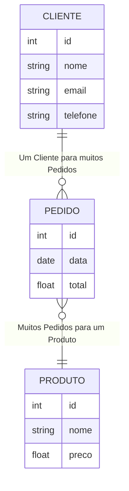

# Modelagem de Dados

**Nome do Estagiário:** Guilherme Canarini Kaneda
**Data:** 02/08/2024

**Módulos:**  
1. **Definição**
2. **Tipos de Modelo**
3. **Ciclo da Modelagem de Dados**
4. **Ferramentas** 
5. **Laboratórios** 

## Definição
Modelagem de dados é o processo de criar um modelo para os dados que serão utilizados em um sistema de informação.

- Dado: um valor em sua forma individual.
- Banco de Dados: conjunto de dados organizados e relacionados entre si.
- Informação: insights importantes retirados do Banco de Dados para tomar decisões.
  
O modelo separa o conjunto por meio de entidades que o sistema vai gerenciar, descritos como objetos do mundo real, que, juntamente com seus atributos e chaves primárias, caracterizam o tipo e o tamanho dos dados, para relacionarem entre si.

- Entidade: representam objetos ou conceitos que podem armazenar informações em um banco de dados.
- Relacionamento: definem um vínculo entre duas ou mais entidades. 
- Atributo: informações adicionais através de algum tipo dado.
- Chave Primária: um atributo que identifica unicamente cada registro em uma tabela.

### Exemplo
Uma das principais representações da modelagem de dados, é o Diagrama Entidade-Relacionamento (DER), um fluxograma utilizado para estruturar a lógica e o conceito deles de forma visual.

## Tipos de Modelos
Existem vários tipos de modelos de dados, utilizados conforme a necessidade do modelagem e reaproveitamento dos dados.

- Modelo Conceitual: representa os principais conceitos e entidades sem considerar detalhes técnicos.
- Modelo Lógico: descreve a estrutura lógica dos dados, incluindo tipos de dados, atributos e as relações entre entidades, por meio da cardinalidade.
- Modelo Físico: implementa o modelo de dados em sistema de banco de dados através de uma linguagem, como o SQL.

## Ciclo da Modelagem de Dados
- Coleta de Dados
- Criação do Modelo Conceitual (diagrama)
- Criação do Modelo Lógico (relações)
- Criação do Modelo Físico (código)
- Implementação

## Ferramentas
Existem várias ferramentas utilizadas na modelagem de dados, desde o uso de ferramentas como o Excel e Power BI, até técnicas mais avançadas, que incluem, por exemplo, Sistemas de Banco de Dados Relacionais e Não Relacionais.

- Ferramentas: MySQL Workbench, PostgreSQL Worbench, Power BI, MongoDB e Python (sqlite, MySQLdb e pyPgSQL).

## Laboratórios:

- [Google Colab](https://colab.research.google.com/drive/1nIeyLU__zw8Y9G-kehLAeeUfZrgOluX1?usp=sharing)

**Recursos Utilizados:**  
- sqlite3
- matplotlib

**Principais comandos:**  
- CREATE TABLE
- INSERT INTO
- SELECT FROM

**Próximos Passos:**  
Adicionar novas exemplificações de modelagens.
