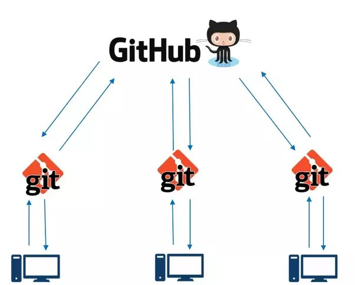
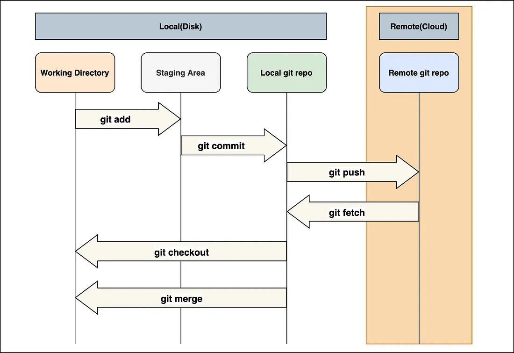

# Git

**Nome do Estagiário:** Guilherme Canarini Kaneda
**Data:** 05/08/2024

**Módulos:**  
1. **Definição**
2. **Comandos**
3. **GitFlow**
4. **Fluxo básico do Git** 
5. **Recursos utilizados** 

## Definição
O Git é um sistema de controle de versão de arquivos, responsável por guardar o histórico de alterações sempre que alguém modificar algum arquivo que está sendo monitorado por ele.

### GitHub
GitHub é a principal plataforma baseada na web que usa Git para controle de versão, conhecida como uma “rede social dev”. 

Ele hospeda repositórios na nuvem, permitindo que desenvolvedores colaborem em projetos usando os comandos Git de seus repositórios locais.



## Comandos
Cada comando tem várias opções que permitem um controle sobre a conexão, envio, mensagem e variação de um repositório.

### Clonagem
O comando "git clone" clona um repositório armazenado no git para uma pasta local. 

```
git init
git clone https://github.com/usuario/repo.git
cd repo
```
### Estado e Histórico
O comando "git status" indica as informações da repositório local: a branch que ela está apontada e os possíveis "commits" dela.

```
git status
```

Agora, para exibir o histórico de "commits" da branch atual, usa-se o comando "git log".

```
git log
```

### Staging area
Antes de realizar um "commit", devemos adicionar os arquivos na staging area, o espaço para preparar as alterações que serão refletidas no próximo "commit".

Para isso, o comando "git add" especifica os arquivos a serem adicionados na staging area.

```
git add arquivo.txt
git add .
```
### Commit
O comando "git commit" cria um novo "commit" dos arquivos da staging area com uma mensagem descritiva.

```
git commit -m "mensagem de commit"
```

### Sincronização
O comando "git pull" é a junção do comando "git fetch" seguido por "git merge", pois baixa e mescla as alterações da branch atual, sincronizando o repositório local com o repositório remoto.

```
git pull
```

Por fim, o comando "git push" envia os commits da branch local para o repositório remoto.

```
git push
```
### Desfazer alterações
#### Remover arquivo da staging area
O comando "git reset" remove um arquivo do staging area, mantendo as mudanças no repositório local.
```
git reset arquivo.txt
```
#### Desfazer "commit"
Já para desfazer um "commit", usa-se o comando "git reset --soft", "git reset --mixed" ou "git reset --hard".
  
- **git reset --soft**: remove o "commit" do histórico da branch atual, mas as mudanças permanecem na stading area e no repositório local.
- **git reset --mixed**:  remove o "commit" do histórico da branch atual e as  mudanças da stading area, mas são mantidas no repositório local.
- **git reset --hard**: remove o "commit" do histórico da branch atual, da stading area e do repositório local.

```
git reset --hard HEAD~1
```
#### Restaurar arquivo para o último "commit"
O comando "git restore" restaura a versão de arquivos para a do último "commit" realizado. Essa ação é definitiva.
```
git restore arquivo.txt
```
## GitFlow
Gitflow é um modelo de ramificação para Git, organizado através de branches, linhas simultâneas de desenvolvimento independente.
Principais branches: 
- Master/Main: versão do código que está pronta para produção.
- Develop: desenvolvimento ativo, o código mais recente com as funcionalidades e correções que estão sendo desenvolvidas.
- Features da Develop: criadas a partir da branch develop para desenvolver novas funcionalidades particularmente.
- Hotfix: correções rápidas e urgentes para a main. 

Quando um nova branche é criada dentro de outra, ela possui o mesmo histórico de "commits".

### Navegar entre branches
Para navegar entre as branches, usa-se o comando "git checkout".
```
git checkout <branche>
```
### Criar nova branche
O comando "git checkout -b" cria uma branche apontada para a atual e entra nela.
```
git checkout -b <nova_branche>
```
### Mesclar branches
O comando "git merge" mescla a branche atual com a branche filha.
```
git checkout <branche_pai>
git merge <branche_filha>
```
### Excluir branche
Após a mesclagem de branches, a branche filha torna-se inútil. O comando "git branch -d" exclue uma branche.

```
git branch -d <branche>
```

## Fluxo básico no Git
1. **git init**: inicia git no repositório local.
2. **git clone**: clona um repositório remoto para o repositório local. 
3. **git add**: adiciona as alterações na staging area.
4. **git commit**: cria uma mensagem das alterações na staging area.
5. **git pull**: puxa as alterações do repositório remoto para evitar conflito.
6. **git push**: envia o "commit" para o repositorio remoto. 



## Recursos utilizados
- [OneNote](https://1drv.ms/o/s!AhYuzTaU_zLktCMaSiZAcxjVqW7E)
- [Curso DIO](https://www.dio.me/courses/versionamento-de-codigo-com-git-e-github)

**Próximos Passos:**  
Adicionar novas exemplificações de versionamento.
