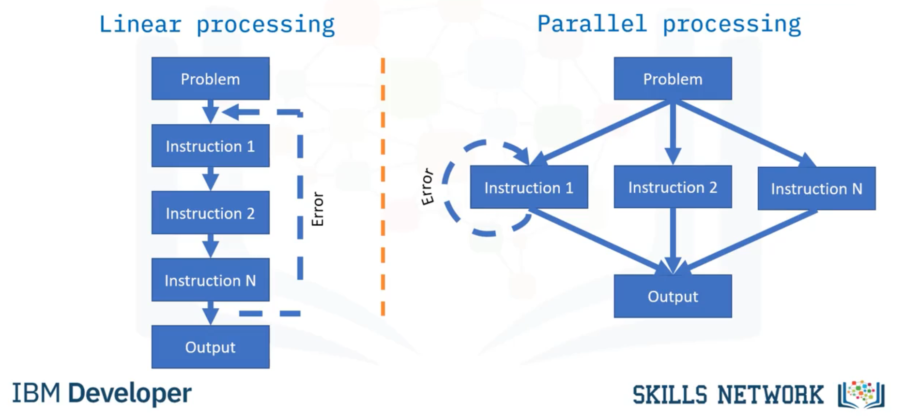

# Big Data

**Nome do Estagiário:** Guilherme Canarini Kaneda
**Data:** 07/08/2024

**Módulos:**  
1. **Definição**
2. **Ciclo de vida do Big Data**
3. **Processamento paralelo**
4. **Hadoop** 
5. **Recursos utilizados** 

## Definição
Big Data é um processo de armazenamento, análise e tratamento de dados muito grandes e complexos para os sistemas RDBMS tradicionais. 

_"A ideia básica por trás da expressão 'Big Data' é que tudo o que fazemos está cada vez mais deixando um rastro digital (ou dados), que podemos usar e analisar para nos tornarmos mais inteligentes. As forças motrizes nesse novo mundo são o acesso a volumes crescentes de dados e nossa capacidade tecnológica cada vez maior de minerar esses dados para obter insights comerciais."_ - Bernard Marr

Assim, o Big Data pode ser: 

- Estruturado (como tabelas RDBMS) 

- Semiestruturado (como arquivos de log) 

- Não estruturado (como imagens, dados de mídia social) 

Porém, nem toda organização requer tecnologias Big Data e processamento dos dados diferente dos métodos tradicionais. Essa necessidade surge somente quando há: 

- Volume (grandes volumes de dados em TB ou PB ou até mais) 

- Variedade (Estruturada, Não Estruturada e Semiestruturada) 

- Velocidade (a velocidade de geração, carregamento e análise de dados) 

- Veracidade (a qualidade e validade dos dados) 

- Valência (como os itens de dados são conectados uns aos outros) 

Já o compartilhamento de dados deve ser incentivado removendo barreiras ao acesso a dados e erradicando silos de dados. 

**Silos**: dados são dados compartimentados dentro de uma organização que não têm conexão entre si. 

## Ciclo de vida do Big Data 

1. **Coleta**: a coleta do Big Data é iniciada como resultado de um problema ou requisito comercial. 

2. **Coleção**: é armazenado em uma estrutura de armazenamento distribuído, como o Handpoop HDFS. 

3. **Modelagem**: as tarefas e scripts do Map and Reduce criam um modelo capaz de ser armazenado em um banco de dados, a partir de entidades e relacionamentos. 

4. **Processamento**: para o processamento, ferramentas como o Apache Spark, produzem informações a partir dos dados modelados. 

5. **Visualização**: as informações são visualizadas por meio de gráficos e tabelas. 

## Processamento paralelo 

O processamento paralelo do Big Data, diferente do linear, envolve a execução simultânea de múltiplas operações ou tarefas em diferentes unidades de processamento.  

As instruções são distribuídas para vários nós com poder de processamento semelhante para serem executadas paralelamente, possibilitando que os erros possam ser corrigidos individualmente, sem afetas os outros processos.

### Escalabilidade horizontal 

A escalabilidade horizontal, estratégia usada pelo processamento paralelo, refere-se à adição de nós ou máquinas adicionais à uma infraestrutura para lidar com novas demanda, de modo a comportarem-se como um único computador. 

Tais nós individuais organizados são chamados de cluster de computação, capazes de resolver cálculos "embaraçosamente paralelos" coordenadamente, ou seja, cada processo deve estar ciente do estado dos outros processos do cluster para concluir o cálculo. 

## Hadoop

O maior componente do Big Data é o projeto Hadoop, uma ferramenta open-source que permite o armazenamento e processamento distribuído de grandes conjuntos de dados entre clusters de computadores.  

### Hadoop MapReduce 

O MapReduce, estrutura central do Hadoop, é um padrão de programação que permite escalabilidade horizontal massiva em clusters Hadoop, com componentes que se comunicam entre si. 

O "Map" do algoritmo recebe um arquivo de entrada que são separados em um modelo chave-valor e agrupados de acordo com um fator comum. Uma vez o dados mapeados, o "Reduce" sintetiza-os em um único valor final. 

### Hadoop File System (HDFS) 

O HDFS, sistema de armazenamento do Hadoop, é distribuído em vários servidores, dividindo e copiando os arquivos em blocos para diferentes nós e, assim, restaurando-os caso necessário. 

Com os dados divididos, a replicação e transferência das partições de um nó para outro é simplificada, visto que, caso um dado seja corrompido, há uma cópia salva. 

### Yet Another Resource Negotiator (YARN) 

A ideia fundamental do YARN é dividir as funcionalidades de gerenciamento de recursos e agendamento de tarefas. A ideia é ter um ResourceManager (RM) global e um ApplicationMaster (AM) por aplicativo.  

O ResourceManager é a autoridade máxima que arbitra recursos entre todos os aplicativos no sistema. Já o NodeManager é o agente de estrutura por computador responsável pelos contêineres, monitorando o uso de recursos (CPU, memória, disco e rede) e relatando ao ResourceManager. 

### Ferramentas 

O Hadoop possui muitos outros projetos relacionados também, como: Sqoop, Zookeeper, Avro, Hbase, Hive, Impala, Pig e entre outros que são conhecidos por Ecossistema Hadoop. 

## Recursos utilizados
- [Medium](https://medium.com/analytics-vidhya/big-data-an-introduction-b7bc048081c9)
- [Curso IBM](https://www.coursera.org/learn/introduction-to-big-data-with-spark-hadoop?courseSlug=introduction-to-big-data-with-spark-hadoop)

**Próximos Passos:**  
Adicionar novas explicações do Ecossitema Hadoop.
