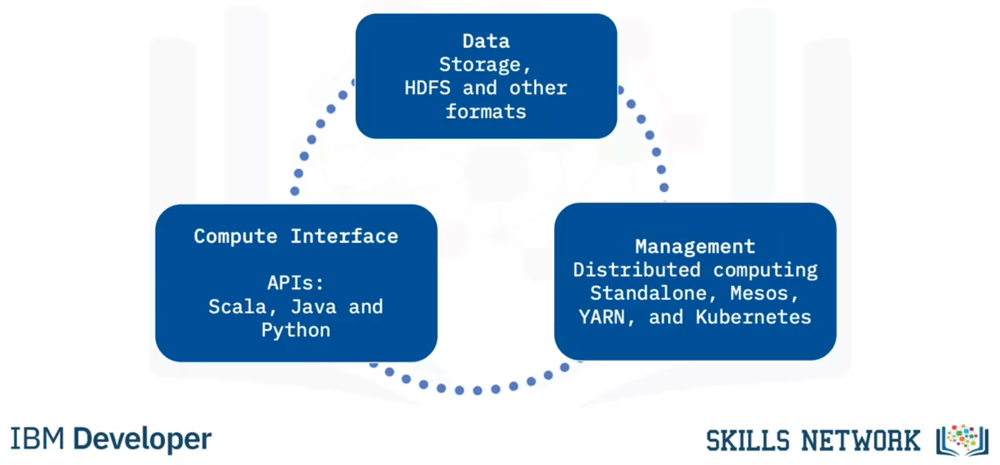
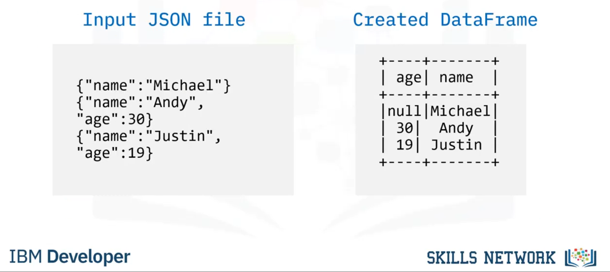

# Linguagens e Frameworks

**Nome do Estagiário:** Guilherme Canarini Kaneda
**Data:** 13/08/2024

**Módulos:**  
1. **Python**
2. **Apache Spark**
3. **Apache Beam**
4. **Recursos utilizados** 

## Python
Python é uma linguagem de altíssimo nível orientada a objeto, de tipagem dinâmica e forte, interpretada e interativa.

### Tipos de dados
| Tipo        | Descrição                                         | Exemplo                   |
|-------------|---------------------------------------------------|---------------------------|
| `int`        | Números inteiros                                  | `x = 10`                  |
| `float`      | Números com ponto decimal                         | `y = 3.14`                |
| `str`        | Sequências de caracteres                          | `name = "Alice"`          |
| `bool`       | Valores lógicos (`True` ou `False`)               | `flag = True`             |
| `list`       | Sequências ordenadas e mutáveis                   | `numbers = [1, 2, 3]`     |
| `tuple`      | Sequências ordenadas e imutáveis                  | `point = (1, 2)`          |
| `set`        | Coleções não ordenadas e sem duplicatas           | `unique_numbers = {1, 2, 3}` |
| `dict`       | Coleções de pares chave-valor                      | `person = {'name': 'Alice', 'age': 30}` |

### Estruturas de decisão
| Estrutura    | Descrição                                         | Exemplo                                               |
|--------------|---------------------------------------------------|-------------------------------------------------------|
| `if`         | Avalia uma expressão e executa um bloco de código se verdadeiro | ```if x > 10: print("x é maior que 10") ``` |
| `elif`       | Testa múltiplas condições após um `if`           | ```if x > 10: print("x é maior que 10") elif x == 10: print("x é igual a 10") ``` |
| `else`       | Executa um bloco de código se todas as condições anteriores forem falsas | ```if x > 10: print("x é maior que 10") else: print("x não é maior que 10") ``` |

### Estruturas de repetição 
| Estrutura    | Descrição                                         | Exemplo                                               |
|--------------|---------------------------------------------------|-------------------------------------------------------|
| `for`        | Itera sobre uma sequência (lista, tupla, string) | ```for i in range(5): print(i) ```             |
| `while`      | Executa um bloco de código enquanto a condição for verdadeira | ```count = 0 while count < 5: print(count) count += 1 ``` |
| `break`      | Interrompe o loop imediatamente                    | ```for i in range(10): if i == 5: break print(i) ``` |
| `continue`   | Pula o restante do código no loop atual e passa para a próxima iteração | ```for i in range(10): if i % 2 == 0: continue print(i) ``` |


### Bibliotecas
A linguagem, além de incluir diversas estruturas de alto nível, também possui uma vasta gama de bibliotecas que cobrem diferentes áreas de aplicação, desde análise de dados até desenvolvimento web. Em Python, muitas bibliotecas são instaladas por padrão junto com o programa.

### [Colab](https://colab.research.google.com/drive/1mW2bdzEQZQk52Pp2KoC9Kk-3efthnZB0?usp=sharing)


## Apache Spark (PySpark)
Apache Spark é uma estrutura de aplicativos em memória de código aberto para processamento distribuído e análise iterativa em grandes volumes de dados.



Componentes do Spark: 

- Armazenamento: o conjunto de dados são carregados de um armazenamento, como o HDFS, para a memória. 

- APIs: o Spark tem APIs em linguagens de alto nível, como o Python, Java e Scala, para manipular sua interface e os RDDs. 

- Gerenciamento do cluster: controle dos aspectos de computação distribuída do Spark, como memória RAM, disco e rede. 

### RDDs  

Os conjuntos de dados distribuídos resilientes (RDDs) é a principal abstração de dados do Spark, uma coleção imutável de elementos particionados entre os nós do cluster que podem ser operados em paralelo.  

É possível criar um RDD com um arquivo no sistema de arquivos do Hadoop, ou outro sistema de arquivos compatível (csv, txt, JSON, etc.). Uma vez criados não é possível alterá-los, assim, a alternativa para isso é a criação de novos RDDs, que podem ser feitos através das operações: 

- Transformação: criam um novo conjunto de dados a partir de um existente 

- Ação: retornam um valor para o programa de driver após a execução de um cálculo no conjunto de dados. 

Logo, um RDD de entrada não é alterado, mas sim transformado por meio de operações em um novo ou novos RDDs. 

### Spark SQL 

O SparkSQL é compatível com APIs Java, Scala, Python e R, permitindo a execução de consultas SQL no nosso conjunto de dados do Spark. 

A API fornece uma abstração de programação chamada de DataFrames, que age como um motor de consultas SQL, semelhante aos que os SGBDs possuem. 



### [Colab](https://colab.research.google.com/drive/1y56fdCfiP21gEvAuqgg48_5UIF-Vf4d0?usp=sharing)

## Apache Beam

Apache Beam é um modelo de programação unificado para definir e executar pipelines de processamento de dados em lote e em fluxo (streaming). 


Com o Beam, é possível escrever trabalhos de processamento de dados, também conhecidos como pipelines, em várias linguagens, por exemplo, Java, Python e SQL, e executar em diferentes sistemas de execução, como Google Dataflow, Apache Flink, Apache Spark, e outros.

### [Colab](https://colab.research.google.com/drive/1v-WpUqJn6fxZqgapBZ41w8s1muadJyFx?usp=sharing)

### Pipeline

Um pipeline refere-se a uma sequência de etapas ou estágios que processam dados de forma contínua e sistemática. Cada etapa no pipeline realiza uma transformação ou ação sobre os dados e passa o resultado para a próxima etapa.


## Recursos utilizados
- [Documentação Apache Beam](https://beam.apache.org/documentation/transforms/python/aggregation/sample/)
- [Curso IBM](https://www.coursera.org/learn/introduction-to-big-data-with-spark-hadoop?courseSlug=introduction-to-big-data-with-spark-hadoop)

**Próximos Passos:**  
Adicionar novas explicações de frameworks.
