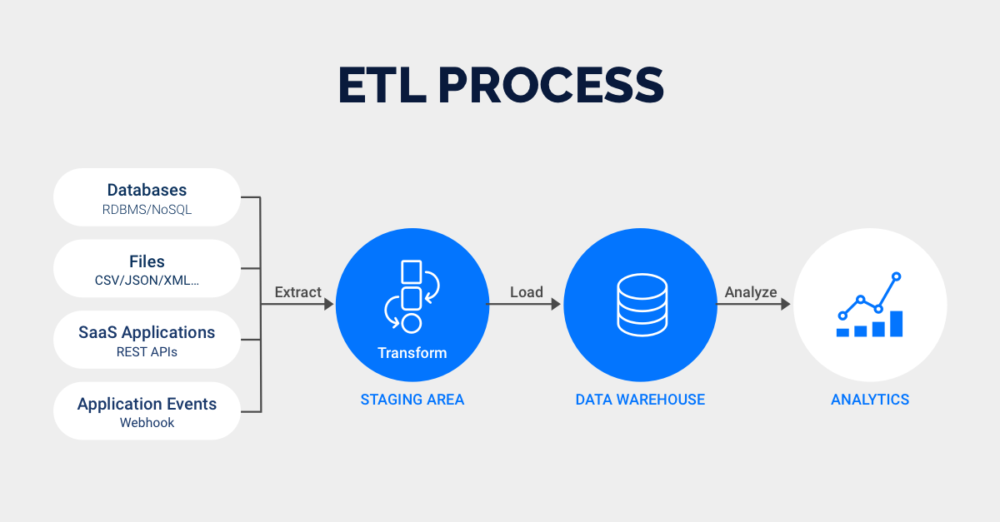
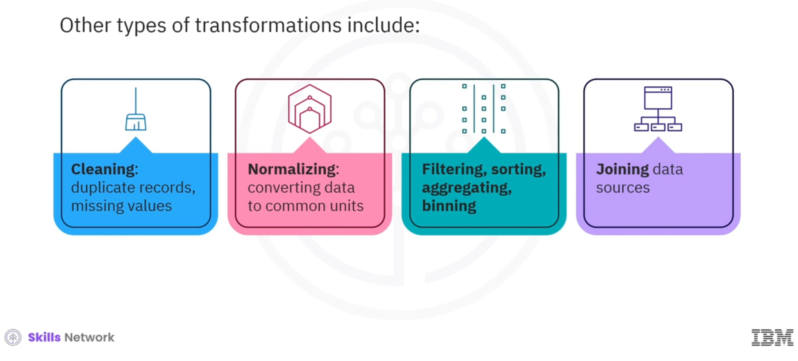
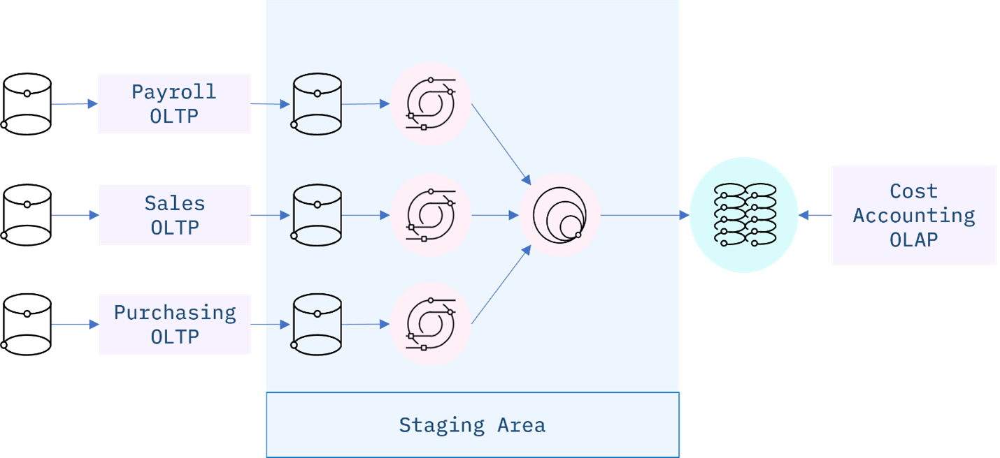
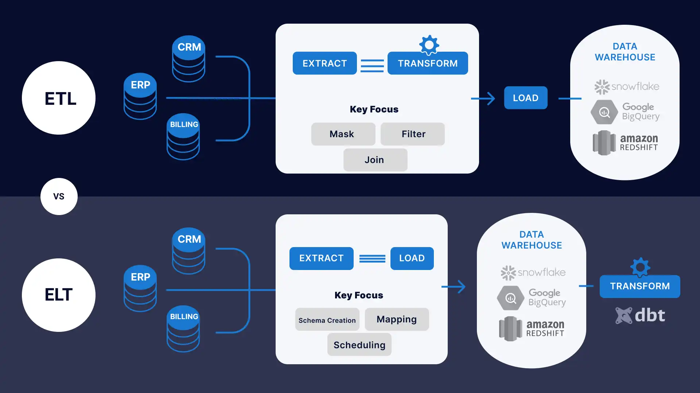

# Engenharia de Dados

**Nome do Estagiário:** Guilherme Canarini Kaneda
**Data:** 19/08/2024

**Módulos:**  
1. **Definição**
2. **Processo**
3. **OLTP e OLAP**
4. **ELT** 
5. **Recursos utilizados** 

## Definição
O ETL (Extrair, Transformar e Carregar) é uma metodologia automatizada de engenharia de pipeline de dados, na qual os dados são adquiridos e preparados para uso posterior em um ambiente de análise. Esse processo envolve a curadoria de dados de várias fontes, adequando-os a um formato ou estrutura de dados unificada e, em seguida, carregando-os em seu novo ambiente. 

## Processo

- **Extração**: Obtenção ou leitura dos dados de uma ou mais fontes de forma assíncrona, como páginas da web, utilizando APIs para analisar o HTML, movendo-os para a área de preparação. 

- **Transformação**: Os dados são organizados em um formato adequado ao destino e ao uso pretendido. Isso inclui a correção de erros, filtragem e mesclagem de valores para garantir a qualidade e a consistência dos dados. 

- **Carregamento**: Transfere os dados transformados para seu novo ambiente de armazenamento. O carregamento pode ocorrer em tempo real ou em lotes programados, incluindo tanto o carregamento inicial dos dados de origem quanto a inserção de alterações incrementais nos dados existentes. 

Ou seja, os dados devem ser extraídos, tratados e carregados de acordo com seu objetivo, por meio de: 

- Tratamento de erros e valores ausentes; 
- Filtragem dos dados; 
- Agrupamento dos dados (JOIN); 
- Criação de KPIs (Key Performance Indicators) para análise de desempenho. 

## OLTP e OLAP

O Sistemas de Processamento de Transações Online (OLTP) refere-se a sistemas de banco de dados que são projetados para gerenciar transações diárias e operacionais, servindo para designar os sistemas operacionais com dados transacionais.  

Por outro lado, o Processamento Analítico Online (OLAP), é uma habilidade para executar dentro do Data Warehouse e realizar análises dos grandes volumes de dados. Os sistemas OLAP usam modelos de dados multidimensionais, como cubos, para que você possa visualizar os mesmos dados de diferentes ângulos.  

Assim, os processos de ETL capturam o histórico de transações (OLTP) e o preparam para análise subsequente em um sistema OLAP. 

## ELT

Ao contrário do processo ETL, onde as transformações são realizadas dentro da pipeline antes que os dados cheguem ao destino, o ELT (Extrair, Carregar e Transformar) separa essas transformações da pipeline, permitindo que elas ocorram diretamente no ambiente de destino. 

Portanto, o ELT copia ou exporta os dados dos locais de origem, mas, em vez de carregá-los em uma área de preparação para transformação, ele carrega os dados brutos diretamente no armazenamento de dados de destino para serem transformados conforme necessário. 

Além disso, esses processos diferem em sua capacidade de lidar com Big Data. Enquanto os processos ETL tradicionalmente lidam com dados relacionais estruturados, os processos ELT são capazes de manejar qualquer tipo de dado, seja ele estruturado ou não estruturado. 

## Recursos utilizados
- [Curso IBM](https://www.coursera.org/learn/etl-and-data-pipelines-shell-airflow-kafka)
- [Amazon](https://aws.amazon.com/pt/compare/the-difference-between-olap-and-oltp/)
- [IBM](https://www.ibm.com/br-pt/topics/elt)

**Próximos Passos:**  
Adicionar explicações das ferramentas do processo ETL e ELT.
