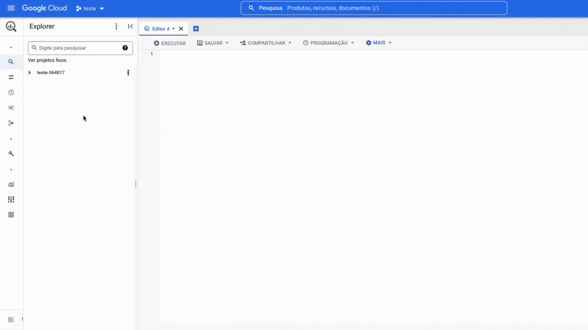

# BigQuery

**Nome do Estagiário:** Guilherme Canarini Kaneda
**Data:** 20/08/2024

**Módulos:**  
1. **Definição**
2. **Funcionamento**
3. **Data Studio**
4. **Particionamento e clustering** 
5. **Recursos utilizados** 

## Definição
O BigQuery é uma plataforma de análise de dados totalmente gerenciada e pronta para IA que ajuda a impulsionar o valor dos dados, funcionando com vários mecanismos, formatos e nuvens.

Essa ferramenta é NoOps, ou seja, ela não requer uma infraestrutura responsável pelo gerenciamento nem um administrador de banco de dados. Assim, é possível a análise de dados para ter acesso a insights relevantes usando um SQL familiar e aprendizado de máquina integrado.

A interação é feita por navegador web próprio, uma linha de comando ou por chamadas para API do REST utilizando linguagens Java, .NET ou Python. Também é possível acessar cópias dos projetos na plataforma Google Cloud. 

## Funcionamento

Para criar um projeto no Google Cloud basta ter um email cadastrado no Google.

Agora, é preciso fixar o projeto no seu BigQuery.

Dentro do projeto existem dois níveis de organização dos dados, datasets (conjuntos de dados) e tables (tabelas).

As tabelas podem ser criadas ou transferidas de outro sistema de armazenamento.

Após adicionado as tabelas, é possível executar comandos SQL, como, no caso, consultas, especificando seu caminho dentro do projeto.

## Data Studio

As consultas podem ser salvas dentro de datasets como tabelas. Assim, podemos representá-las através de gráficos com o Data Studio para uma melhor visualização.

Para isso, no Data Studio, especificamos as métricas, dimensões e o gráfico referentes a consulta.

Feito isso, o gráfico será gerado com as métricas selecionadas.

## Particionamento e clustering

- Cluster: São agrupamentos organizados em uma tabela de acordo com os valores de colunas determinadas. 

- Partição: É a divisão de uma tabela grande em tabelas menores por uma coluna.

Ou seja, uma consulta é executada, o BigQuery lê os dados ao acessar apenas os segmentos que contêm os valores relevantes das colunas de cluster. Assim, em vez de escanear a tabela inteira, apenas as partes necessárias são lidas, o que diminui a quantidade de dados processados.

A combinação de tabela particionada e clusterizada é como armazenar dados em tabelas menores, enquanto os dados são classificados dentro delas.

No canto superior direito da interface, é indicado a estimativa do custo de processamento que será cobrado do seu projeto.

Em um teste de casos, a memória utilizada em uma varredura de uma tabela particionada e clusterizada é sempre menor.

## Recursos utilizados
- [Curso Coursera](https://www.coursera.org/projects/working-with-bigquery)
- [Medium](https://medium.com/@chanon.krittapholchai/partitioning-and-clustering-in-google-bigquery-d197285b0578)
- [Documentação](https://basedosdados.github.io/mais/access_data_bq/#entenda-o-uso-gratuito-do-big-query-bq)

**Próximos Passos:**  
Adicionar explicações de datasets e tabelas no BigQuery.
